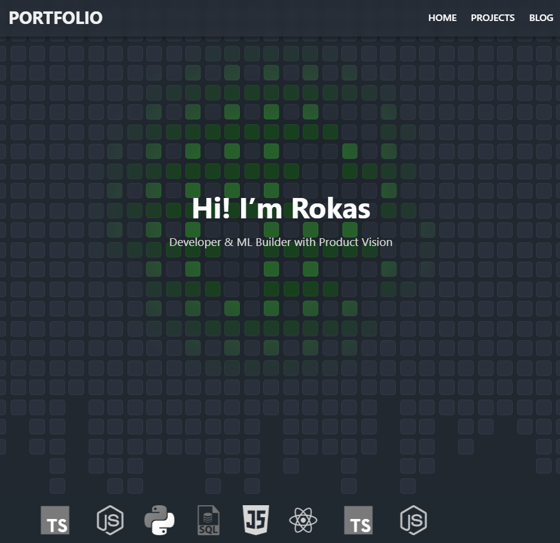

# 🚀 Portfolio – Rokas Jelinskas

Welcome to my personal portfolio, built to showcase my work as a full-stack developer and data scientist with a focus on frontend engineering. This project demonstrates my skills in **TypeScript**, **React**, **Node.js**, and product-focused design thinking.

 

## 🧠 About

This portfolio was designed and developed to serve as both a technical demonstration and a personal landing site. Beyond the visuals, it highlights my ability to:

- Build modern, scalable UIs with React and TypeScript
- Apply clean, responsive layouts using custom CSS (no frameworks)
- Translate product intuition into smooth, purposeful UX
- Deploy production-ready apps using GitHub Pages and Vite

## 🌐 Live Site

▶️ **[View Portfolio](https://rokasauras.github.io/vite-react-deploy/)**

Deployed via GitHub Pages using GitHub Actions.

## ⚙️ Tech Stack

- **Framework**: [React](https://reactjs.org/) + [Vite](https://vitejs.dev/)
- **Language**: TypeScript
- **Styling**: Manual CSS (no Tailwind or Bootstrap)
- **Deployment**: GitHub Pages + Actions
- **Routing**: React Router DOM

## ✨ Features

- Custom spotlight effect using CSS masks + pointer tracking
- Fully responsive layout and scrollable hero section
- Dark theme design with translucent header
- Simple routing with three core views: Home, Projects, Blog
- Clean, scalable structure suitable for extension

## 🗂️ Structure

```bash
├── src/
│   ├── pages/
│   │   ├── Home.tsx
│   │   ├── Projects.tsx
│   │   └── Blog.tsx
│   ├── App.tsx
│   ├── main.tsx
│   └── App.css
├── public/
│   └── hero.jpg (and other images)
├── index.html
└── README.md
